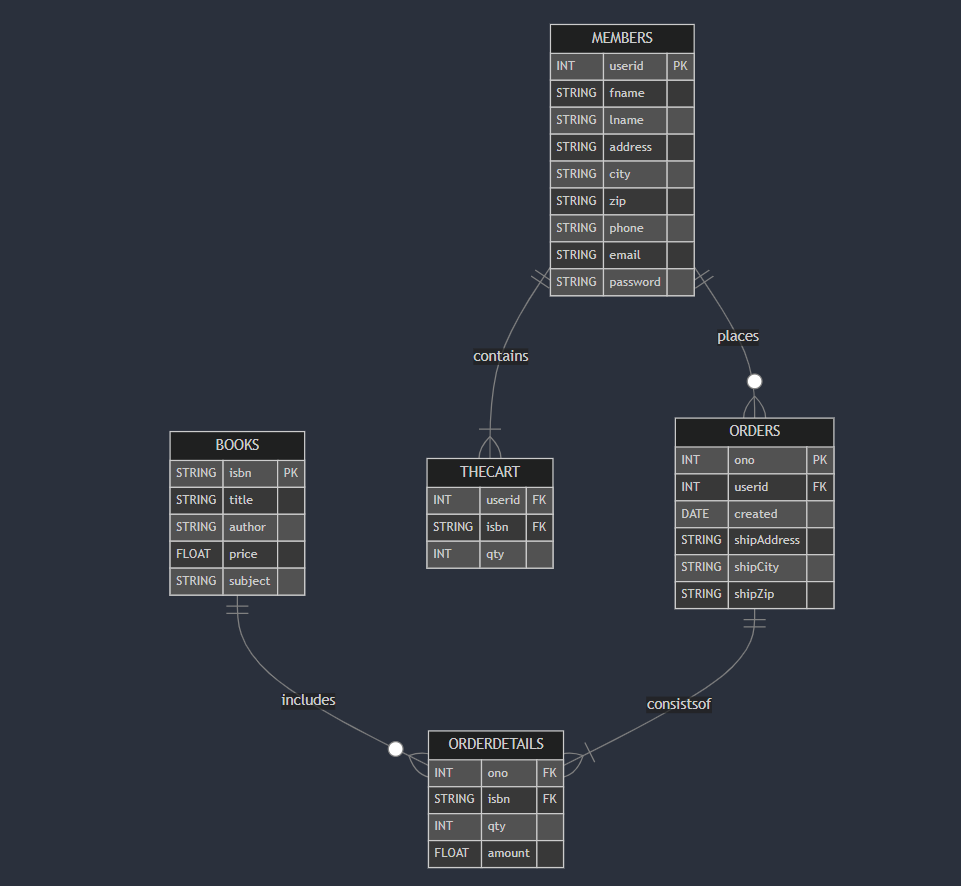

# 📚 Online Bookstore Management System 

### Overview
This project is an Online Bookstore Management System, designed to allow users to browse books, search by author or title, add books to their cart, and proceed to checkout. The system is built using ```Python``` and integrates with a ```MySQL``` database for data management.  

### Features
* User Registration & Login
* Browse Books by Subject
* Search Books by Author or Title
* Add Books to Shopping Cart
* Checkout & Order Processing
* Order Invoice Generation
* MySQL Database Integration

### ER Diagram:
